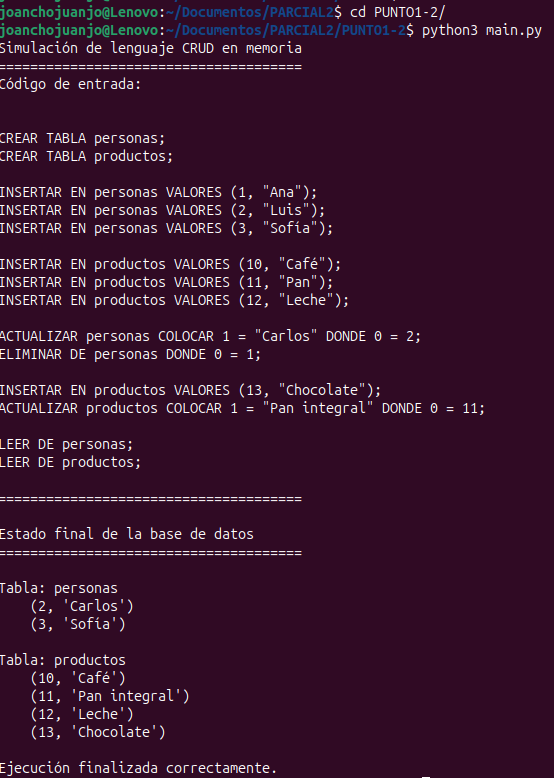
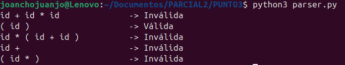
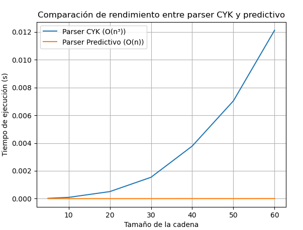
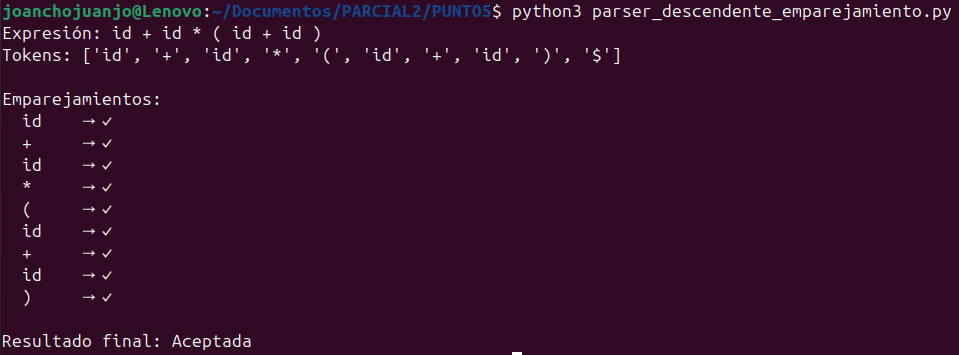

# PARCIAL2Lenguajes

### Punto 1. 

Diseñe una gramática de un lenguaje de programación que permita hacer las operaciones de CRUD en una base de datos.

<pre>grammar gramaticacrud;

programa : (operacionCrud ';')* EOF ;

operacionCrud
    : crearTabla
    | insertarFila
    | leerDatos
    | actualizarDatos
    | eliminarDatos
    ;

crearTabla
    : CREAR TABLA IDENT
    ;

insertarFila
    : INSERTAR EN IDENT VALORES '(' listaValores ')'
    ;

leerDatos
    : LEER DE IDENT (DONDE condicion)?
    ;

actualizarDatos
    : ACTUALIZAR IDENT COLOCAR listaAsignaciones (DONDE condicion)?
    ;

eliminarDatos
    : ELIMINAR DE IDENT (DONDE condicion)?
    ;

listaAsignaciones
    : asignacion (',' asignacion)*
    ;

asignacion
    : (IDENT | NUM) '=' valor
    ;

listaValores
    : valor (',' valor)*
    ;

condicion
    : (IDENT | NUM) comparador valor
    ;

valor
    : TEXTO
    | NUM
    ;

comparador
    : '=' | '!=' | '<' | '<=' | '>' | '>='
    ;

CREAR : 'CREAR';
TABLA : 'TABLA';
INSERTAR : 'INSERTAR';
EN : 'EN';
VALORES : 'VALORES';
LEER : 'LEER';
DE : 'DE';
DONDE : 'DONDE';
ACTUALIZAR : 'ACTUALIZAR';
COLOCAR : 'COLOCAR';
ELIMINAR : 'ELIMINAR';

IDENT : [a-zA-Z_][a-zA-Z_0-9]* ;
NUM   : [0-9]+ ;
TEXTO : '"' (~["\r\n])* '"' ;

WS : [ \t\r\n]+ -> skip ;
COMENTARIO : '--' ~[\r\n]* -> skip ;</pre>

En este punto se elaboró una gramática formal para un lenguaje de programación capaz de realizar operaciones CRUD (Crear, Leer, Actualizar y Eliminar) sobre una base de datos simulada. La gramática define la estructura de sentencias tipo SQL y sirve como base para la generación del analizador léxico y sintáctico. El objetivo fue construir una descripción precisa y no ambigua que permitiera interpretar correctamente las operaciones sobre tablas en memoria.

### Punto 2

Implemente la gramática del punto 1 en BISON o ANTLR y realice pruebas sobre el lenguaje.

#### Visitor

```python
from gramaticacrudVisitor import gramaticacrudVisitor
from gramaticacrudParser import gramaticacrudParser

class BaseDeDatos:
    def __init__(self):
        self.tablas = {}

    def crear(self, nombre):
        if nombre in self.tablas:
            raise Exception(f"La tabla '{nombre}' ya existe.")
        self.tablas[nombre] = []

    def insertar(self, nombre, valores):
        if nombre not in self.tablas:
            raise Exception(f"La tabla '{nombre}' no existe.")
        self.tablas[nombre].append(tuple(valores))

    def leer(self, nombre, condicion):
        if nombre not in self.tablas:
            raise Exception(f"La tabla '{nombre}' no existe.")
        filas = self.tablas[nombre]
        if not condicion:
            return filas
        campo, op, valor = condicion
        return [f for f in filas if self._cumple(f, campo, op, valor)]

    def actualizar(self, nombre, asignaciones, condicion):
        if nombre not in self.tablas:
            raise Exception(f"La tabla '{nombre}' no existe.")
        nuevas = []
        actualizadas = 0
        for fila in self.tablas[nombre]:
            if not condicion or self._cumple(fila, *condicion):
                nueva = list(fila)
                for campo, valor in asignaciones:
                    try:
                        idx = int(campo)
                        nueva[idx] = valor
                    except:
                        pass
                nuevas.append(tuple(nueva))
                actualizadas += 1
            else:
                nuevas.append(fila)
        self.tablas[nombre] = nuevas
        return actualizadas

    def eliminar(self, nombre, condicion):
        if nombre not in self.tablas:
            raise Exception(f"La tabla '{nombre}' no existe.")
        nuevas = []
        eliminadas = 0
        for fila in self.tablas[nombre]:
            if not condicion or self._cumple(fila, *condicion):
                eliminadas += 1
            else:
                nuevas.append(fila)
        self.tablas[nombre] = nuevas
        return eliminadas

    def _cumple(self, fila, campo, op, valor):
        try:
            idx = int(campo)
            izq = fila[idx]
        except:
            izq = fila[0]
        if op == '=': return izq == valor
        if op == '!=': return izq != valor
        if op == '<': return izq < valor
        if op == '<=': return izq <= valor
        if op == '>': return izq > valor
        if op == '>=': return izq >= valor
        return False


class VisitorCRUD(gramaticacrudVisitor):
    def __init__(self):
        self.db = BaseDeDatos()

    def visitCrearTabla(self, ctx: gramaticacrudParser.CrearTablaContext):
        nombre = ctx.IDENT().getText()
        self.db.crear(nombre)
        return f"Tabla '{nombre}' creada."

    def visitInsertarFila(self, ctx: gramaticacrudParser.InsertarFilaContext):
        nombre = ctx.IDENT().getText()
        valores = []
        for v in ctx.listaValores().valor():
            if v.TEXTO():
                valores.append(v.TEXTO().getText().strip('"'))
            else:
                valores.append(int(v.NUM().getText()))
        self.db.insertar(nombre, valores)
        return f"Insertado en '{nombre}': {valores}"

    def visitLeerDatos(self, ctx: gramaticacrudParser.LeerDatosContext):
        nombre = ctx.IDENT().getText()
        cond = None
        if ctx.condicion():
            campo = ctx.condicion().children[0].getText()
            op = ctx.condicion().comparador().getText()
            v = ctx.condicion().valor()
            valor = v.TEXTO().getText().strip('"') if v.TEXTO() else int(v.NUM().getText())
            cond = (campo, op, valor)
        return self.db.leer(nombre, cond)

    def visitActualizarDatos(self, ctx: gramaticacrudParser.ActualizarDatosContext):
        nombre = ctx.IDENT().getText()
        asign = []
        for a in ctx.listaAsignaciones().asignacion():
            campo = a.children[0].getText()
            v = a.valor()
            valor = v.TEXTO().getText().strip('"') if v.TEXTO() else int(v.NUM().getText())
            asign.append((campo, valor))
        cond = None
        if ctx.condicion():
            campo = ctx.condicion().children[0].getText()
            op = ctx.condicion().comparador().getText()
            v = ctx.condicion().valor()
            valor = v.TEXTO().getText().strip('"') if v.TEXTO() else int(v.NUM().getText())
            cond = (campo, op, valor)
        n = self.db.actualizar(nombre, asign, cond)
        return f"Actualizadas en '{nombre}': {n}"

    def visitEliminarDatos(self, ctx: gramaticacrudParser.EliminarDatosContext):
        nombre = ctx.IDENT().getText()
        cond = None
        if ctx.condicion():
            campo = ctx.condicion().children[0].getText()
            op = ctx.condicion().comparador().getText()
            v = ctx.condicion().valor()
            valor = v.TEXTO().getText().strip('"') if v.TEXTO() else int(v.NUM().getText())
            cond = (campo, op, valor)
        n = self.db.eliminar(nombre, cond)
        return f"Eliminadas en '{nombre}': {n}"
```

#### Main

```python
from antlr4 import *
from gramaticacrudLexer import gramaticacrudLexer
from gramaticacrudParser import gramaticacrudParser
from VisitorCRUD import VisitorCRUD


def ejecutar_codigo(codigo):
    entrada = InputStream(codigo)
    lexer = gramaticacrudLexer(entrada)
    tokens = CommonTokenStream(lexer)
    parser = gramaticacrudParser(tokens)
    arbol = parser.programa()
    visitador = VisitorCRUD()
    visitador.visit(arbol)
    return visitador.db.tablas


codigo = """
CREAR TABLA personas;
CREAR TABLA productos;

INSERTAR EN personas VALORES (1, "Ana");
INSERTAR EN personas VALORES (2, "Luis");
INSERTAR EN personas VALORES (3, "Sofía");

INSERTAR EN productos VALORES (10, "Café");
INSERTAR EN productos VALORES (11, "Pan");
INSERTAR EN productos VALORES (12, "Leche");

ACTUALIZAR personas COLOCAR 1 = "Carlos" DONDE 0 = 2;
ELIMINAR DE personas DONDE 0 = 1;

INSERTAR EN productos VALORES (13, "Chocolate");
ACTUALIZAR productos COLOCAR 1 = "Pan integral" DONDE 0 = 11;

LEER DE personas;
LEER DE productos;
"""

print("Simulación de lenguaje CRUD en memoria")
print("======================================")
print("Código de entrada:\n")
print(codigo)
print("======================================\n")

tablas = ejecutar_codigo(codigo)

print("Estado final de la base de datos")
print("======================================")
for nombre, filas in tablas.items():
    print(f"\nTabla: {nombre}")
    if not filas:
        print("   (sin registros)")
    else:
        for fila in filas:
            print("   ", fila)

print("\nEjecución finalizada correctamente.")
```

#### Salida



La gramática diseñada en el punto anterior fue implementada usando ANTLR4, Se empleó el patrón Visitor para recorrer el árbol sintáctico y ejecutar las operaciones correspondientes sobre una estructura de datos en memoria.
El analizador permite interpretar las instrucciones del lenguaje CRUD, crear tablas, insertar registros y modificarlos dinámicamente.

### Punto 3

Para la gramática:

E → E + T | T 
T → T * F | F 
F → ( E ) | id

#### - Eliminando la recursion por la izquierda

<pre>E  → T E'
E' → + T E' | ε
T  → F T'
T' → * F T' | ε
F  → ( E ) | id
</pre>

#### - Conjuntos de primeros

<pre>PRIMEROS(E)  = { '(', id }
PRIMEROS(E') = { '+', ε }
PRIMEROS(T)  = { '(', id }
PRIMEROS(T') = { '*', ε }
PRIMEROS(F)  = { '(', id }
</pre>

#### - Conjunto de siguientes

<pre>SIGUIENTES(E)  = { ')', $ }
SIGUIENTES(E') = { ')', $ }
SIGUIENTES(T)  = { '+', ')', $ }
SIGUIENTES(T') = { '+', ')', $ }
SIGUIENTES(F)  = { '*', '+', ')', $ }
</pre>

#### - Conjunto de Prediccion:

<pre>E  → T E'         { '(', id }
E' → + T E'       { '+' }
E' → ε            { ')', $ }
T  → F T'         { '(', id }
T' → * F T'       { '*' }
T' → ε            { '+', ')', $ }
F  → ( E )        { '(' }
F  → id           { id }
</pre>

```python
def parser(expr):
    tokens = expr.replace("(", " ( ").replace(")", " ) ").split()
    tokens.append("$")  # símbolo de fin de entrada
    pila = []
    i = 0

    def reduce():
        # E → E + T
        if len(pila) >= 3 and pila[-3:] == ['E', '+', 'T']:
            pila[-3:] = ['E']; return True
        # T → T * F
        if len(pila) >= 3 and pila[-3:] == ['T', '*', 'F']:
            pila[-3:] = ['T']; return True
        # F → ( E )
        if len(pila) >= 3 and pila[-3:] == ['(', 'E', ')']:
            pila[-3:] = ['F']; return True
        # F → id
        if len(pila) >= 1 and pila[-1] == 'id':
            pila[-1:] = ['F']; return True
        # T → F
        if len(pila) >= 1 and pila[-1] == 'F':
            pila[-1:] = ['T']; return True
        # E → T
        if len(pila) >= 1 and pila[-1] == 'T':
            pila[-1:] = ['E']; return True
        return False

    while True:
        # Intentar reducir antes de hacer shift
        if reduce():
            continue

        # Aceptar si se llegó al final correctamente
        if i >= len(tokens):
            return False
        if tokens[i] == '$' and pila == ['E']:
            return True

        # Desplazar siguiente token si queda entrada
        if tokens[i] != '$':
            pila.append(tokens[i])
            i += 1
            continue

        # Si no hay más reducciones ni desplazamientos válidos
        return False


# Pruebas
tests = [
    "id + id * id",
    "( id )",
    "id * ( id + id )",
    "id +",
    "( id * )"
]

for t in tests:
    resultado = "Válida" if parser(t) else "Inválida"
    print(f"{t:<25} -> {resultado}")
```

#### Salida Esperada:



En este punto se desarrolló un analizador sintáctico ascendente para la gramática de expresiones aritméticas.
Primero se transformó la gramática original para eliminar la recursión por la izquierda y calcular los conjuntos FIRST, FOLLOW y PREDICT, garantizando su corrección formal.
Luego se implementó un algoritmo shift–reduce en Python, que usa una pila para aplicar reducciones según las producciones definidas.
Finalmente, se verificó su funcionamiento mediante pruebas con expresiones válidas e inválidas, demostrando que el analizador reconoce correctamente las estructuras gramaticales y valida la sintaxis conforme a las reglas establecidas.

### Punto 4

Implemente un parser usando el algoritmo CYK. Realice pruebas sobre el rendimiento de este algoritmo comparándolo con un parser de tipo predictivo. Realice una comparación entre el rendimiento de los dos parser.

```python
import time
import random
import matplotlib.pyplot as plt

# ------------------------------------------------------------
# Parser usando el algoritmo CYK
# ------------------------------------------------------------
def cyk_parse(cadena, gramatica, simbolo_inicial):
    n = len(cadena)
    if n == 0:
        return False

    tabla = [[set() for _ in range(n)] for _ in range(n)]

    # Casos base: reglas A -> a
    for i in range(n):
        for A, reglas in gramatica.items():
            for regla in reglas:
                if len(regla) == 1 and regla[0] == cadena[i]:
                    tabla[i][i].add(A)

    # Combinaciones
    for longitud in range(2, n + 1):
        for i in range(n - longitud + 1):
            j = i + longitud - 1
            for k in range(i, j):
                for A, reglas in gramatica.items():
                    for regla in reglas:
                        if len(regla) == 2:
                            B, C = regla
                            if B in tabla[i][k] and C in tabla[k + 1][j]:
                                tabla[i][j].add(A)

    return simbolo_inicial in tabla[0][n - 1]


# ------------------------------------------------------------
# Parser predictivo simple (recursivo)
# ------------------------------------------------------------
def parser_predictivo(cadena, indice=0):
    def E():
        nonlocal indice
        if T():
            while indice < len(cadena) and cadena[indice] == '+':
                indice += 1
                if not T():
                    return False
            return True
        return False

    def T():
        nonlocal indice
        if F():
            while indice < len(cadena) and cadena[indice] == '*':
                indice += 1
                if not F():
                    return False
            return True
        return False

    def F():
        nonlocal indice
        if indice < len(cadena) and cadena[indice] == 'a':
            indice += 1
            return True
        elif indice < len(cadena) and cadena[indice] == '(':
            indice += 1
            if not E():
                return False
            if indice < len(cadena) and cadena[indice] == ')':
                indice += 1
                return True
        return False

    resultado = E()
    return resultado and indice == len(cadena)


# ------------------------------------------------------------
# Comparación de rendimiento
# ------------------------------------------------------------
def generar_cadena(n):
    return [random.choice(['a', '+', '*', '(', ')']) for _ in range(n)]

# Gramática para CYK (forma normal de Chomsky simplificada)
gramatica = {
    'S': [['A', 'B'], ['A']],
    'A': [['a'], ['A', 'a']],
    'B': [['b'], ['B', 'b']]
}

longitudes = [5, 10, 20, 30, 40, 50, 60]
tiempos_cyk = []
tiempos_pred = []

for n in longitudes:
    cadena = ['a'] * n  # cadena simple de 'a' repetidas

    inicio = time.time()
    cyk_parse(cadena, gramatica, 'S')
    tiempos_cyk.append(time.time() - inicio)

    expr = 'a+' * (n // 2) + 'a'
    inicio = time.time()
    parser_predictivo(list(expr.replace(' ', '')))
    tiempos_pred.append(time.time() - inicio)

# ------------------------------------------------------------
# Gráfica comparativa
# ------------------------------------------------------------
plt.plot(longitudes, tiempos_cyk, label="Parser CYK (O(n³))")
plt.plot(longitudes, tiempos_pred, label="Parser Predictivo (O(n))")
plt.xlabel("Tamaño de la cadena")
plt.ylabel("Tiempo de ejecución (s)")
plt.title("Comparación de rendimiento entre parser CYK y predictivo")
plt.legend()
plt.grid(True)
plt.show()
```

#### Resultado esperado: 



Se implementó el algoritmo CYK (Cocke–Younger–Kasami), un método de análisis sintáctico ascendente basado en programación dinámica, que funciona con gramáticas en forma normal de Chomsky. El parser CYK fue comparado con un parser predictivo LL(1) midiendo los tiempos de ejecución para cadenas de diferentes longitudes. Los resultados mostraron que CYK tiene un costo computacional cúbico (O(n³)), mientras que el parser predictivo mantiene un crecimiento lineal (O(n)), lo que evidencia sus diferencias de eficiencia y alcance.

### Punto 5

Diseñe e implemente un algoritmo de emparejamiento para el algoritmo descendente recursivo.

```python
class Parser:
    def __init__(self, tokens):
        self.tokens = tokens
        self.i = 0
        self.emparejamientos = []

    def actual(self):
        return self.tokens[self.i] if self.i < len(self.tokens) else '$'

    def emparejar(self, esperado):
        if self.actual() == esperado:
            self.emparejamientos.append((esperado, "✓"))
            self.i += 1
            return True
        else:
            self.emparejamientos.append((esperado, f"x (se encontró {self.actual()})"))
            return False

    def E(self):
        if not self.T(): return False
        return self.Ep()

    def Ep(self):
        if self.actual() == '+':
            self.emparejar('+')
            if not self.T(): return False
            return self.Ep()
        return True

    def T(self):
        if not self.F(): return False
        return self.Tp()

    def Tp(self):
        if self.actual() == '*':
            self.emparejar('*')
            if not self.F(): return False
            return self.Tp()
        return True

    def F(self):
        if self.actual() == '(':
            self.emparejar('(')
            if not self.E(): return False
            return self.emparejar(')')
        elif self.actual() == 'id':
            return self.emparejar('id')
        return False

    def analizar(self):
        resultado = self.E() and self.actual() == '$'
        return resultado, self.emparejamientos


def tokenizar(expr):
    tokens = []
    i = 0
    while i < len(expr):
        c = expr[i]
        if c.isspace():
            i += 1
            continue
        if c.isalpha():
            j = i
            while j < len(expr) and expr[j].isalnum():
                j += 1
            tokens.append("id")
            i = j
        elif c in "+*()":
            tokens.append(c)
            i += 1
        else:
            raise ValueError(f"Símbolo no válido: {c}")
    tokens.append('$')
    return tokens


if __name__ == "__main__":
    expr = "id + id * ( id + id )"
    tokens = tokenizar(expr)
    parser = Parser(tokens)
    resultado, emp = parser.analizar()

    print("Expresión:", expr)
    print("Tokens:", tokens)
    print("\nEmparejamientos:")
    for e in emp:
        print(f"  {e[0]:<5} → {e[1]}")
    print("\nResultado final:", "Aceptada" if resultado else "Rechazada")
```

#### Salida Esperada



En este punto se diseñó un algoritmo de emparejamiento dentro de un parser descendente recursivo, capaz de mostrar el proceso de reconocimiento sintáctico paso a paso.El analizador recorre la entrada aplicando reglas gramaticales de forma descendente y registrando cada coincidencia o error de emparejamiento entre los tokens esperados y los leídos. Este enfoque permite visualizar cómo opera un analizador descendente, mostrando la secuencia de derivaciones y validando la estructura sintáctica de una expresión.
